# Documentation d'administration de l'application #

* Statut
  - [ ] à rédiger
  - [x] en cours de rédaction
  - [ ] relecture
  - [ ] finaliser
  - [ ] révision

# Fonctionnel de gestion du patrimoine des biens de l'immobiler d'entreprises et leur mise en disponiblité sur le marché

Ici vous est présenté, temporairement, les premiers tests fonctionnels depuis l'application WebSIG permettant de gérer les données.

### Etape 1 - A la saisie d'un objet (terrain ou local), il faut choisir le bien saisi

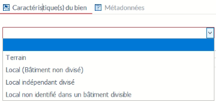

### Etape 2- En fonction du bien saisi, la fiche propose un ensemble d'attributs disponible à la saisie

### Etape 2.1 - Si je saisi un terrain, 4 onglets disponibles à saisir

#### Etape 2.1.1 - L'onglet description permet d'indiquer les éléments patrimoniaux du bien.

Particularité(s) à noter :
* l'attribut "Occupant ou type d'occupation" permet de spécifier un usage si l'onglet "Occupants - Occupation" ne peut être complété. Exemple d'un parking d'entreprise, on pourra indiquer ici Parking de ....
* L'attribut "Identifiant de la base Adresse" permettra de lier le bien à une adresse de la BAL (fonctionnalité à développer). Dans le cas contraire, la saisie d'une adresese libre est possible.

#### Etape 2.1.2 - L'onglet propriété permet d'indiquer les éléments concernant le propriétaire du terrain

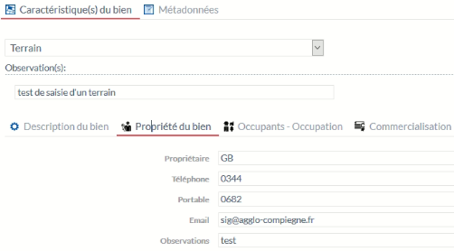

#### Etape 2.1.3 - L'onglet "Occupants - Occupation" permet d'ajouter un ou des établissements occupants le bien

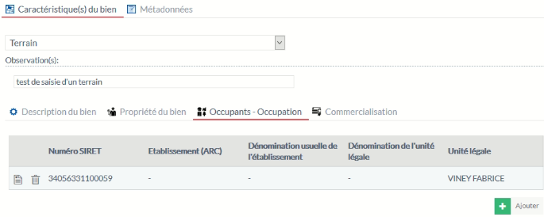

Particularité(s) à noter :
* même si le bien est un terrain, un établissement peut l'occuper sans avoir de bâtiment
* le bouton "AJOUTER" permet de sélectionner un établissement par son SIRET, nom de l'établissement ou de son unité légale
* 0 ou n établissements peuvent être ajoutés
* l'icône "fiche" à gauche permet d'accéder à la fiche de l'établissement
* l'icôbe "poubelle" permet de supprimer l'établissement de la liste

#### Etape 2.1.4 - L'onglet "Commercialisation" permet de rendre le bien disponible à la vente ou à la location

ATTENTION : par défaut un bien du patrimoine saisi n'est pas concerné par cette disponiblité si celle-ci n'est pas modifiée.

##### Etape 2.1.4.1 - Cas d'un bien non concerné par une disponibilité

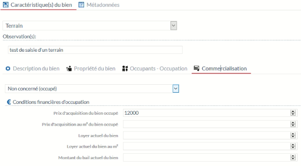

Particularité(s) à noter :
* lorsqu'un bien n'est pas mis en disponiblité, seules ces informations financières d'occupation actuelles sont accessibles

##### Etape 2.1.4.2 - Cas d'un bien concerné par une disponibilité de vente (vacant ou occupé)

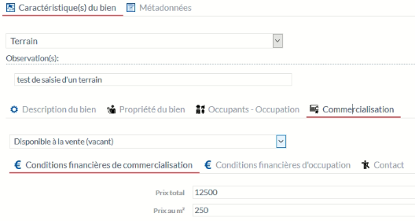

Particularité(s) à noter :
* l'onglet "Conditions financières d'occupation" est toujours disponibles
* 2 nouveaux onglets : "Conditions financières de commercialisation" et "Contact" sont accessibles

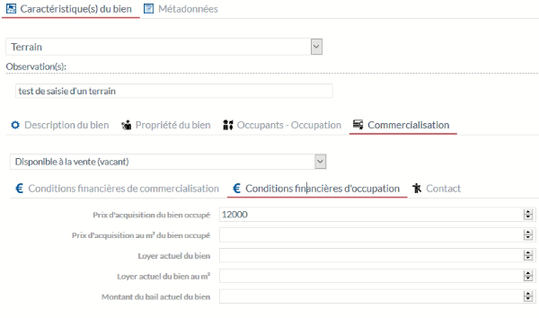

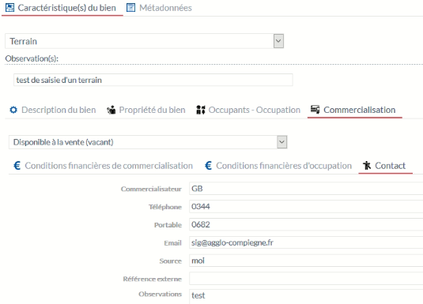

### Etape 2.2 - Si je saisi un "local (Bâtiment non divisé)", il s'agit ici d'un bien (local d'activité) qui correspondant aux bâtiments

#### Etape 2.2.1 - L'onglet "Bâtiment" permet de renseigner les éléments du bâtiment contenant le bien (non présent pour un terrain)

##### Etape 2.2.1.1 - L'onglet "Bâtiment" description (du bâtiment) permet d'indiquer les éléments descriptifs du bâtiment contenant le patrimoine du bien.

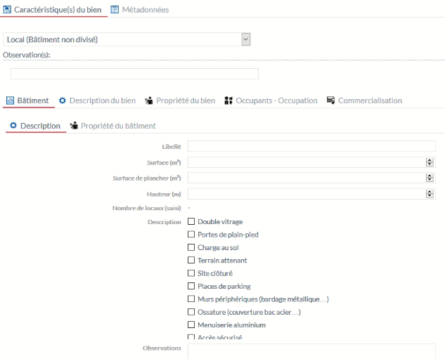

Particularité(s) à noter :
* Contraitement au terrain, un onglet supplémentaite est disponible permettant de décrire le bâtiment
* les éléments descriptifs du bâtiment seront modifiés pour se limiter aux éléments consitutant le bâtiment et non des éléments partoculier à des locaux.
* Plusieurs éléments descriptifs sont sélectionnables
* le nombre de locaux saisis correspond aux nombres de bien déclaré dans ce bâtiment. Dans ce cas présent, le nombre sera de 1. Ce calcul sera automatisé dans la base de données.

##### Etape 2.2.1.2 - L'onglet "Propriété" renseigne sur la propriété du bâtiment

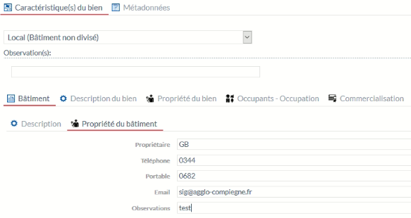

Particularité(s) à noter :
* un fonctionnel permettra d'indiquer si la propriété est commune au bien (local) saisi, ce qui automatisera la saisie

### Etape 2.2.2 - L'onglet description permet d'indiquer les éléments patrimoniaux du bien.

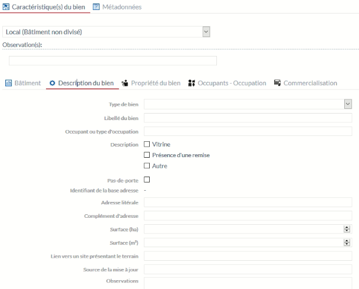

Particularité(s) à noter :
* 3 attributs supplémentaires par rapport à la saisi d'un terrain : `Type de bien`, `description` et `pas-de-porte`
* le type de bien permet de sélectionner dans une liste de valeur `Activité`, `Bureau` ou `Commerce`
* la partie description est à revoir comme pour les bâtiments pour une mise en cohérence
* l'information "pas-de-porte" est intégrée ici avec une valeur `false` par défaut et permettra de développer ce suivi sur les commerces de centre-ville

### Etape 2.2.3 - Les onglets "Propriété du bien", "Occupants-Occupations" et "Commercialisation" 

Ces onglets sont identiques à la saisie d'un terrain donc pas de rappel ici, cf Etape 2.1.

### Métadonnée - Pour tous biens saisis, un onglet "Métadonnée" est disponible au niveau supérieur de la fiche.

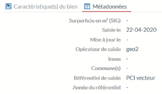
